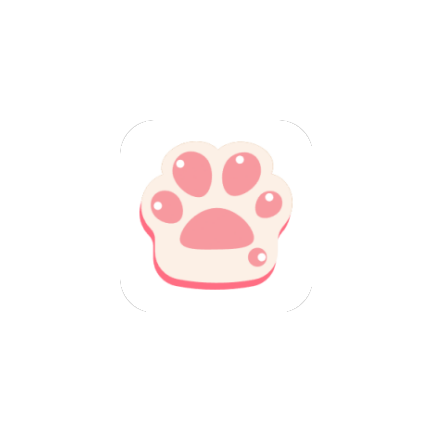

<p align="center">
  
</p>

<h1 align="center">Pawchive</h1>

<p align="center">
  <a href="README.md">中文</a> | <a href="README.ja.md">日本語</a>
</p>

<p align="center">
  A polished, fluid third-party Android client for the full <a href="https://pawchive.pw">Pawchive</a> experience.<br/>
  Aggregates creator content from Patreon, Fanbox, Discord and more — browse, search, bookmark, and enjoy immersive media playback.
</p>

<p align="center">
  
  
  
  
  
</p>

<p align="center">
  <a href="https://github.com/FengByX/Pawchive/releases">
    
  </a>
  <a href="https://t.me/PawchiveX">
    
  </a>
</p>

---

## Features

### Content Browsing
- **Home feed**: Paginated latest posts with keyword filters and multiple sort modes
- **Creator profiles**: Posts, announcements, fan cards, and linked accounts
- **Post details**: Full content, comment threads, revision history, file downloads
- **Multi-platform**: Aggregates Patreon, Fanbox, Discord with brand-colored tags

### Smart Search
- **Keyword search**: Searches posts and creators simultaneously with tabbed results
- **File hash lookup**: Trace source material by file hash, including Discord results
- **Search history**: Locally persisted, with single-item delete and clear-all

### Immersive Media
- **HD image viewer**: Pinch-to-zoom, double-tap zoom, free drag
- **Video player**: Media3 ExoPlayer with Bilibili-style controls, playback speed, fullscreen, resume from last position
- **Multi-domain fallback**: Three-tier automatic degradation (thumbnail → original → download CDN)

### Bookmarks & Accounts
- Multi-account switching with isolated bookmarks/history/downloads
- Offline bookmark archive (Room FTS4): search and read saved posts without network
- **Cloud bookmarks**: Sync saved posts and creators when logged in
- **Local bookmarks**: Manage bookmarks locally without login

### Download Center
- **okdownload resumable engine**: Auto-resume from breakpoint after network interruption
- **Progress notifications**: Real-time download progress in notification bar
- **Background downloads**: Continues when app is in background
- **Download rules**: Auto-download by creator / service / file type
- **History management**: Cancel, retry, and clear download records

### Personalization
- **Languages**: 中文 / English / 日本語, switch instantly
- **Appearance**: Light / Dark / System default, Material Design 3 theme
- **Download manager**: Custom download directory (SAF), cache viewer and cleaner
- **Content updates**: Periodically check for new posts from subscribed creators
- **In-app updates**: Auto-check GitHub Releases with semantic version comparison

---

## Tech Stack

| Category | Technology | Notes |
|----------|-----------|-------|
| **Language** | Kotlin 2.2.10 | Modern, null-safe JVM language |
| **Min SDK** | API 30 (Android 11) | Covers 95%+ active devices |
| **Target SDK** | API 36 | Latest Android version |
| **UI** | XML + ViewBinding | Declarative layouts, type-safe access |
| **Design** | Material Design 3 | Card groups, segmented buttons, brand tags |
| **Modularization** | Multi Gradle modules | `app` / `feature-*` / `data` / `core` |
| **DI** | Hilt + KSP | `@HiltAndroidApp` / `@AndroidEntryPoint` |
| **Storage** | Room + DataStore | Room for history/archive, DataStore for settings |
| **Download** | okdownload 1.0.7 | Resumable, progress callbacks, OkHttp integration |
| **Network** | Retrofit + OkHttp | Type-safe HTTP client |
| **Images** | Coil 2.6 | Kotlin-first, coroutine-native |
| **Video** | AndroidX Media3 | ExoPlayer + OkHttp data source |
| **Build** | Gradle 9.4.1 + AGP 9.2.1 | Version catalog dependency management |

---

## Key Technical Highlights

### 1. okdownload Resumable Download Engine
Integrates [lingochamp/okdownload](https://github.com/lingochamp/okdownload) as the download core:
- **Resumable**: Auto-resume from breakpoint after network drops
- **Coroutine-driven**: Runs directly in CoroutineScope
- **Cloudflare credential injection**: Reuses `sharedOkHttpClient` with cf_clearance / User-Agent

### 2. Automatic Cloudflare Challenge Bypass
The target site uses Cloudflare protection; plain OkHttp requests get 403. `CloudflareManager` runs JS challenges in a hidden WebView, extracts the `cf_clearance` cookie, binds the User-Agent, and injects into all subsequent OkHttp requests.

### 3. Smart Interceptor Chain
- **Domain-scoped injection**: Credentials only injected for `pawchive.pw` main domain, not image CDN subdomains
- **Non-blocking 403 fallback**: Auto-retry once with forced refresh on 403
- **Dual OkHttpClient**: CF-intercepted client separated from lightweight client

### 4. Single Activity + Modular Navigation
- Main Tab Fragments are cached and reused, no rebuild on switch
- **AppNavigator interface**: Feature modules navigate via interface, zero direct inter-module dependencies

### 5. Skeleton Loading
Custom `SkeletonHelper` implements shimmer pulse animation with 200ms fade transition when content loads.

---

## Project Structure

```
Pawchive/
├── app/                          # Assembly: Application / MainActivity
├── feature-common/               # Shared UI: SkeletonHelper / adapters
├── feature-home/                 # Home feed
├── feature-search/               # Search
├── feature-post/                 # Post details / image viewer / fullscreen video
├── feature-downloads/            # Download center
├── feature-settings/             # Settings
├── feature-account/              # Account / login / bookmarks
├── data/                         # Business layer: Repository / Manager
├── core/                         # Infrastructure: network / models / Room
└── gradle/libs.versions.toml     # Version catalog
```

**Dependency direction**: `:app` → `:feature-*` → `:data` → `:core`

---

## Getting Started

### Requirements
- **Android Studio** Meerkat (2024.3+) or higher
- **JDK** 17+
- **Gradle** 9.2+ (wrapper included)

### Clone & Build

```bash
git clone https://github.com/FengByX/Pawchive.git
cd Pawchive
./gradlew assembleRelease
```

> APK output: `app/build/outputs/apk/release/Pawchive-v1.6.6.apk`

### Install

Download the latest APK from [Releases](https://github.com/FengByX/Pawchive/releases) and install on an Android 11+ device.

---

## Permissions

| Permission | Purpose |
|-----------|---------|
| `INTERNET` | Network requests |
| `ACCESS_NETWORK_STATE` | Network status detection |
| `POST_NOTIFICATIONS` | Download progress notifications (Android 13+) |
| `FOREGROUND_SERVICE` | Download foreground service |

---

## Contributing

Issues and Pull Requests are welcome. Before submitting:
1. Keep code style consistent with existing code
2. Add string resources for all three languages
3. Follow Material Design 3 guidelines

---

## License

This project is open source under the **MIT License**.

---

<p align="center">
  <sub>Icons by <a href="https://lucide.dev">Lucide</a> · Inspired by Material Design 3</sub>
</p>
