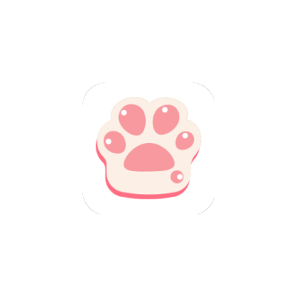

<p align="center">
  
</p>

<h1 align="center">Pawchive</h1>

<p align="center">
  <a href="README.md">中文</a> | <a href="README.en.md">English</a>
</p>

<p align="center">
  <a href="https://pawchive.pw">Pawchive</a> プラットフォームの完全な体験をもたらす、洗練されたサードパーティ製 Android クライアント。<br/>
  Patreon、Fanbox、Discord などのクリエイターコンテンツを集約し、閲覧・検索・ブックマーク・没入型メディア再生に対応。
</p>

<p align="center">
  
  
  
  
  
</p>

<p align="center">
  <a href="https://github.com/FengByX/Pawchive/releases">
    
  </a>
  <a href="https://t.me/PawchiveX">
    
  </a>
</p>

---

## 機能

### コンテンツ閲覧
- **ホームフィード**：最新コンテンツのページネーション読み込み、キーワードフィルタに対応。「同一クリエイターは 1 件のみ」「ブックマーク済みクリエイターを非表示」も選択可能
- **クリエイタープロフィール**：投稿、お知らせ、ファンカード、関連アカウントを表示
- **投稿詳細**：完全な本文（ホワイトリスト HTML レンダリング）、コメント、改訂履歴、添付ファイルのダウンロード
- **マルチプラットフォーム**：Patreon、Fanbox、Discord などを集約、プラットフォームタグはブランドカラー

### スマート検索
- **キーワード検索**：投稿とクリエイターを同時に検索、タブで結果を切り替え
- **ファイルハッシュ検索**：ファイルハッシュで素材の出典を追跡、Discord の結果にも対応
- **オフライン全文検索**：Room FTS4 と CJK バイグラム分割によるインデックスで、ネットワークなしでもブックマークを検索可能
- **検索履歴**：ローカルに永続化、保持件数は設定可能（5〜50）、個別削除と全消去に対応

### 没入型メディア
- **画像ビューア**：ピンチズーム、ダブルタップズーム、境界制約付きドラッグ
- **アニメーション画像**：GIF / アニメーション WebP / アニメーション HEIF に対応。リストでは「GIF」バッジで判別可能
- **動画再生**：Media3 ExoPlayer ベース、Bilibili 風コントロール、再生速度、前回位置から再開、ピクチャーインピクチャー。フルスクリーンはインラインプレーヤーのインスタンスを再利用し、出入りで再バッファリングなし、アスペクト比を維持した表示
- **段階的フォールバック**：原画を優先し、存在しない場合はサムネイルへ自動的に切り替え

### ブックマークとアカウント
- **マルチアカウント切り替え**：ブックマーク / 履歴 / ダウンロードをアカウントごとに分離
- **クラウドブックマーク**：ログイン時に保存した投稿とクリエイターを同期し、書き込み後は即座にキャッシュを無効化
- **ローカルブックマーク**：ログイン不要。ブックマークするとオフラインアーカイブのインデックスも作成
- **オフライン閲覧**：ブックマークした投稿の全文アーカイブ（Room FTS4）により、オフラインでも検索と閲覧が可能

### コンテンツ購読と通知
- **クリエイター購読**：お気に入りのクリエイターを登録すると新着投稿を定期的に確認（間隔は設定可能、最小 15 分）。「ブックマークで自動購読」も選択可能
- **システム通知**：新着投稿を検知すると即座に通知。いつでもオフにできます
- **アプリ内通知センター**：ホームのベルアイコンから直接開け、未読バッジはリアルタイム更新。個別既読とすべて既読に対応し、購読管理ページでいつでも解除できます

### ダウンロードセンター
- **HTTP Range レジューム**：一時停止時は一時ファイルを保持し、Range リクエストで再開。サーバーが Range を無視した場合は全量ダウンロードに自動降格
- **タスクごとの通知**：1 タスクにつき 1 件の通知で、進捗率・ダウンロード済みサイズ・速度（EMA 平滑化）・残り時間を表示。通知内から一時停止 / 再開 / キャンセルが可能
- **バックグラウンド継続**：`dataSync` フォアグラウンドサービスで保活し、バックグラウンドでも中断しない
- **ダウンロードルール**：クリエイター / サービス / ファイル種別ごとに自動的にキューへ追加
- **サーバー配慮**：同時実行は 5 に制限、同一ファイルの再試行間隔は 1 秒以上、識別可能な独自 User-Agent

### カスタマイズ
- **多言語**：中文 / English / 日本語、即時切り替え
- **外観**：ライト / ダーク / システム従属、6 種類のアクセントテーマ、Material Design 3
- **表示と拡大**：UI 全体の拡大率と文字サイズを連続スライダーで調整、リアルタイムプレビューと即時反映
- **通信量節約**：リストは既定でサムネイルを読み込み、原画に切り替え可能
- **ダウンロード設定**：カスタムディレクトリ（SAF）、最大同時実行数（1〜5）、再試行回数（1〜3）、Wi-Fi のみ、ファイル命名形式
- **自動バックアップ**：選択したディレクトリへ毎日バックアップを書き出し
- **アプリ内更新**：GitHub Release を自動確認、セマンティックバージョン比較、STABLE / BETA チャンネル、「このバージョンを無視」に対応

---

## 技術スタック

| カテゴリ | 技術 | 備考 |
|----------|------|------|
| **言語** | Kotlin 2.3.20 | AGP 9.3.2 に同梱。Kotlin プラグインの個別適用は不要 |
| **最小 SDK** | API 30 (Android 11) | アクティブ端末の大多数をカバー |
| **ターゲット / コンパイル SDK** | API 36 (minorApiLevel 1) | 最新 Android バージョン |
| **UI** | XML + ViewBinding | 宣言的レイアウト、型安全アクセス |
| **デザイン** | Material Design 3 | カードグループ、セグメントボタン、ブランドカラータグ |
| **モジュール化** | 10 個の Gradle モジュール | `app` / 7×`feature-*` / `data` / `core` |
| **DI** | Hilt 2.59.2 + KSP 2.3.6 | `@HiltAndroidApp` / `@AndroidEntryPoint` |
| **ストレージ** | Room 2.8.4 + DataStore 1.1.1 | ダウンロード履歴とオフラインアーカイブは Room、設定は DataStore |
| **ダウンロード** | 独自 OkHttp ストリーミング | 1.7.0 で okdownload を置換。単一接続 + HTTP Range レジューム |
| **ネットワーク** | Retrofit 2.9.0 + OkHttp 4.12.0 | 型安全 HTTP クライアント |
| **画像** | Coil 2.6.0 + coil-gif | コルーチンネイティブ。`ImageDecoderDecoder` を登録しアニメーション画像に対応 |
| **動画** | AndroidX Media3 1.4.1 | ExoPlayer + OkHttp データソース |
| **バックグラウンド処理** | WorkManager 2.9.0 + Hilt | 定期購読同期、自動バックアップ、キャッシュ整理 |
| **ビルド** | Gradle 9.5.0 + AGP 9.3.2 | バージョンカタログ（`libs.versions.toml`）を依存の唯一の情報源とする |
| **品質ゲート** | Kover 0.9.9 | コア層（core + data）の行カバレッジ 45% 以上 |

---

## 主な技術的ハイライト

### 1. Cloudflare チャレンジの自動回避

対象サイトは Cloudflare 保護下にあり、通常の OkHttp リクエストは 403 で遮断されます。`CloudflareManager` が非表示 WebView で JS チャレンジを実行し、`cf_clearance` Cookie を抽出して、**それが紐付く User-Agent とともに**以降の全 OkHttp リクエストへ注入します：

- **シングルフライト**：並行呼び出しは 1 つの `CompletableDeferred` を共有するため、複数の WebView が同時に起動することはありません
- **認証情報の永続化**：EncryptedSharedPreferences に保存し、25 分の TTL 内であればコールドスタートでもチャレンジを省略
- **`session` の除去**：WebView が書き込む匿名 session Cookie は実際のログインセッションに重なり 401 の誤判定を招くため、注入前に必ず除去
- **堅牢化**：WebView の生成と設定は全体をフォールバック保護（サードパーティ実装が `Error` を投げてもクラッシュしない）。`onRenderProcessGone` をオーバーライドし、レンダラのクラッシュがプロセス全体を巻き込まないようにしています

### 2. OkHttp 直結ストリーミングダウンロードエンジン

1.7.0 で okdownload を撤去しました。ソースレベルでの検証により、sync スレッドの `LockSupport.park()` にタイムアウトがなく、マルチブロックダウンロードがサーバーのレート制限方針に反する並行 Range リクエストを発行し、応答切断時には不可解なエラーを投げることが判明したためです。現在は単一接続のストリーミングダウンロードです：

- **一時停止 / 再開**：一時停止時は一時ファイルを保持し、`Range: bytes=N-` で再開。サーバーが Range を無視して 200 を返した場合は全量ダウンロードに静かに降格
- **切断検知**：`Content-Length` と実読み取りバイト数を比較し、途中で切れた場合は即座に失敗してバックオフ再試行
- **中断可能**：読み取りループは 64KB ごとにコルーチンの生存を確認するため、キャンセルはダウンロードと書き出しの両フェーズで即座に効きます
- **一時ファイルの分離**：まず一時ファイルへ書き込み、成功後にのみターゲットストリームへコピーするため、再試行が書き出し済みバイトを汚染しません
- **4 種類のクライアント分離**：ダウンロード用クライアントは `callTimeout` を設定しません（設定すると 60 秒で転送しきれないファイルがウォッチドッグに切断されるため）。メモリキャッシュインターセプターも装着しません

### 3. スマートインターセプターチェーン

- **スコープ限定注入**：Cookie・Referer・User-Agent はメインドメイン `pawchive.pw` にのみ注入。CDN サブドメインには User-Agent のみを注入（ホットリンク対策や認証情報の漏洩を回避）
- **403 フォールバック**：`ClearanceRetryInterceptor` が 403 時に強制リフレッシュして 1 回再試行
- **ログのマスク処理**：`Authorization` / `Cookie` / `Set-Cookie` は常にマスクされ、release ビルドではログ出力自体が無効
- **アカウント単位のキャッシュ**：GET の JSON 応答を 5 分間キャッシュ。キーはセッションハッシュの名前空間を持ち（アカウント間の再利用を排除）、パス単位で正確に無効化できます

### 4. シングル Activity + モジュラーナビゲーション

- ボトムナビゲーションと **ViewPager2** が双方向に連動し、メイン Tab は指のスワイプに追従
- `offscreenPageLimit = 1`：ホームとブックマークが同時にプリロードして同じチャレンジ処理を奪い合うのを防ぎます
- **AppNavigator インターフェース**：各 feature はインターフェース経由で遷移し、モジュール間の直接依存はゼロ

### 5. オフラインアーカイブと全文検索

- ブックマーク時に Room のエンティティ行と FTS4 のシャドウ行を 1 トランザクションで書き込み、両者の整合性を保証
- **CJK バイグラム分割**：分かち書きが不要な中国語も検索可能
- **関連度の重み付け**：タイトル > クリエイター > 本文/添付の順に層別検索し、重み順にマージして重複を除去

### 6. パフォーマンスと使い勝手

- **スケルトンローディング**：カスタム `SkeletonHelper` による shimmer パルスアニメーション（「アニメーションを減らす」で全体を無効化可能）
- **起動パスのノンブロッキング化**：言語・外観・拡大率は軽量な SharedPreferences の起動キャッシュから読み、DataStore には触れません
- **メモリスナップショット + 非同期書き込み**：設定とブックマークはメモリから読み、書き込みは非同期。UI は即座に反応します

---

## プロジェクト構成

```
Pawchive/
├── app/                    # アセンブリ層：Application / MainActivity / メインページャー
├── feature-common/         # 共通 UI：SkeletonHelper / ZoomableImageView / 共通アダプター / AppNavigator
├── feature-home/           # ホームフィード
├── feature-search/         # 検索（オンライン + オフライン全文）
├── feature-post/           # 投稿詳細 / 画像ビューア / 動画再生
├── feature-downloads/      # ダウンロードセンター
├── feature-settings/       # 設定（ダウンロードルール、購読、バックアップ、キャッシュ管理）
├── feature-account/        # アカウント / ログイン / ブックマーク
├── data/                   # ビジネス層：Repository / ダウンロードエンジン / Worker / GitHub 更新確認
├── core/                   # インフラ：ネットワーク / モデル / Room / DataStore / ユーティリティ
└── gradle/libs.versions.toml   # バージョンカタログ（依存の唯一の情報源）
```

**依存方向**：`:app` → `:feature-*` → `:data` → `:core`

---

## クイックスタート

### 要件
- **Android Studio** Meerkat (2024.3+) 以上
- **JDK** 17+（CI は 21 を使用）
- **Gradle** 9.5.0（ラッパー同梱、SHA-256 検証あり）

### クローン & ビルド

```bash
git clone https://github.com/FengByX/Pawchive.git
cd Pawchive
./gradlew assembleRelease
```

> APK 出力先：`app/build/outputs/apk/release/Pawchive-v<バージョン>.apk`
> （ファイル名は `gradle.properties` の `VERSION_NAME` に由来。同ファイルがバージョンの唯一の情報源で、未設定または不正な場合はビルドが失敗します）

### よく使うタスク

```bash
./gradlew testDebugUnitTest                       # ユニットテスト
./gradlew koverVerify koverHtmlReport             # カバレッジゲートとレポート
./gradlew lintDebug                               # Lint
```

### インストール

[Releases](https://github.com/FengByX/Pawchive/releases) ページから最新 APK をダウンロードし、Android 11+ 端末にインストールしてください。

---

## 権限

| 権限 | 用途 |
|------|------|
| `INTERNET` | ネットワークリクエスト |
| `ACCESS_NETWORK_STATE` | ネットワーク状態検出（Wi-Fi のみのダウンロード、接続確認） |
| `POST_NOTIFICATIONS` | ダウンロード進捗通知とコンテンツ更新通知（Android 13+ では実行時に要求。拒否してもダウンロードと閲覧は継続） |
| `FOREGROUND_SERVICE` | ダウンロードフォアグラウンドサービス |
| `FOREGROUND_SERVICE_DATA_SYNC` | フォアグラウンドサービスの種別（Android 14+ で必須。バックグラウンドのダウンロード継続に必要） |
| `WRITE_EXTERNAL_STORAGE` | API 28 以下のみ宣言。新しいバージョンは MediaStore を使用 |
| `ACCESS_MEDIA_LOCATION` | API 32 以下のみ宣言。メディアの位置情報メタデータを読み取り |

---

## エンジニアリング品質

| 仕組み | 内容 |
|------|------|
| **CI パイプライン** | ビルド（debug + R8 release）、ユニットテスト、Lint、カバレッジゲート、依存レビューの 4 ジョブ構成 |
| **カバレッジのラチェット** | コア層（core + data）の行カバレッジ下限 45%、増加のみ許可。下回ると CI がブロック |
| **R8 マッピングの保管** | release は難読化とリソース圧縮を有効化。`mapping.txt` を CI が 90 日間保管し、実機クラッシュのスタックを復元可能 |
| **依存レビュー** | PR 段階で高リスク以上の脆弱性を含む依存をブロック |
| **クラッシュ診断** | グローバルな `CrashHandler` がクラッシュログを書き出し、FileProvider 経由で共有・エクスポート可能 |
| **3 言語の完全性** | 中国語 / 英語 / 日本語の文字列リソースはキーが完全に一致 |

---

## サポートとセキュリティ

| ドキュメント | 内容 |
|------|------|
| [SUPPORT.md](SUPPORT.md) | サポート期間、更新サイクル、要件、既知の制限、EOL ポリシー |
| [SECURITY.md](SECURITY.md) | 脆弱性の報告窓口と対応期限 |
| [CHANGELOG.md](CHANGELOG.md) | バージョン変更履歴 |
| [NOTICE.md](NOTICE.md) | サードパーティコンポーネントとライセンス |

---

## コントリビューション

Issue と Pull Request を歓迎します。提出前に以下を確認してください：

1. コードスタイルを既存コードに合わせる
2. 新機能には 3 言語の文字列リソースを追加する（`values/`、`values-en/`、`values-ja/` のキーを揃える）
3. Material Design 3 ガイドラインに従う
4. コア層の新しいロジックにはユニットテストを添え、カバレッジをゲート以下に落とさない

---

## ライセンス

本プロジェクトは **MIT License** の下でオープンソース化されています。

---

<p align="center">
  <sub>アイコンは <a href="https://lucide.dev">Lucide</a> より · Material Design 3 に触発されています</sub>
</p>
