<p align="center">
  
</p>

<h1 align="center">Pawchive</h1>

<p align="center">
  <a href="README.en.md">English</a> | <a href="README.ja.md">日本語</a>
</p>

<p align="center">
  一款精致、流畅的第三方 Android 客户端，为你带来 <a href="https://pawchive.pw">Pawchive</a> 平台的完整体验。<br/>
  聚合 Patreon、Fanbox、Discord 等平台的创作者内容，支持浏览、搜索、收藏与沉浸式媒体播放。
</p>

<p align="center">
  
  
  
  
  
</p>

<p align="center">
  <a href="https://github.com/FengByX/Pawchive/releases">
    
  </a>
  <a href="https://t.me/PawchiveX">
    
  </a>
</p>

---

## 功能亮点

### 内容浏览
- **首页信息流**：分页加载最新内容，支持关键词筛选；可选「同作者仅显示一条」与「隐藏已收藏创作者的帖子」
- **创作者主页**：帖子、公告、粉丝卡、关联账号一览
- **帖子详情**：完整正文（白名单 HTML 渲染）、评论、修订历史、附件下载
- **多平台聚合**：Patreon / Fanbox / Discord 等来源，平台标签按品牌色区分

### 精准搜索
- **关键词搜索**：同时检索帖子与创作者，Tab 切换查看
- **文件哈希反查**：通过文件哈希追踪素材出处，支持 Discord 结果
- **离线全文搜索**：基于 Room FTS4 的中文分词索引，断网也能搜收藏内容
- **搜索历史**：本地持久化，保留条数可配置（5–50），支持单条删除与一键清空

### 沉浸式媒体
- **大图查看**：双指缩放、双击缩放、边界约束拖拽
- **动图播放**：GIF / 动画 WebP / 动画 HEIF，列表带「GIF」角标
- **视频播放**：Media3 ExoPlayer，Bilibili 风格控制器，倍速播放、断点续播、画中画；全屏与内嵌共用播放器实例，进出全屏零重新缓冲，画面等比缩放
- **多级回退**：原图优先，缺失时自动回退缩略图

### 收藏与账号
- **多账号切换**：账号间收藏 / 历史 / 下载数据隔离
- **云端收藏**：登录后同步收藏的帖子与创作者，写入后即时失效缓存
- **本地收藏**：无需登录，收藏即建立离线归档索引
- **离线阅读**：收藏帖全文归档（Room FTS4），断网可检索与阅读

### 内容订阅与通知
- **订阅创作者**：关注喜欢的创作者，新帖自动周期检测（间隔可调，最小 15 分钟）；可选「收藏即订阅」
- **系统通知**：检测到新帖即时推送，可随时关闭
- **应用内通知中心**：首页铃铛直达，未读数角标实时刷新；支持单条/全部已读，订阅管理页可随时退订

### 下载中心
- **HTTP Range 断点续传**：暂停保留临时文件，继续时从断点续传；服务端不支持 Range 时自动降级为全量下载
- **独立任务通知**：每条任务一个通知，实时显示百分比 / 已下载大小 / 速度（EMA 平滑）/ 剩余时间，通知内可暂停、继续、取消
- **后台持续下载**：`dataSync` 前台服务保活，切后台不中断
- **下载规则**：按创作者 / 服务 / 文件类型自动入队
- **合规约束**：并发上限钳制 5、同文件重试间隔 ≥1 秒、自定义可识别 User-Agent

### 个性化设置
- **多语言**：中文 / English / 日本語，实时切换
- **外观**：日间 / 夜间 / 跟随系统，6 套主题强调色，Material Design 3
- **显示与缩放**：整体 UI 缩放与全局文字大小滑杆，实时预览、即时生效
- **省流量**：列表默认加载缩略图，可切换为原图
- **下载参数**：自定义下载目录（SAF）、最大并发数（1–5）、重试次数（1–3）、仅 Wi-Fi 下载、文件命名格式
- **自动备份**：每日导出备份到所选目录
- **应用内更新**：自动检查 GitHub Release，语义化版本比较，支持 STABLE / BETA 通道与「忽略此版本」

---

## 技术架构

| 类别 | 技术选型 | 说明 |
|------|---------|------|
| **语言** | Kotlin 2.3.20 | 由 AGP 9.3.2 内置，无需单独应用 Kotlin 插件 |
| **最低 SDK** | API 30 (Android 11) | 覆盖绝大多数活跃设备 |
| **目标 / 编译 SDK** | API 36 (minorApiLevel 1) | 最新 Android 版本 |
| **UI 框架** | XML + ViewBinding | 声明式布局，类型安全访问 |
| **设计语言** | Material Design 3 | 卡片分组、分段按钮、品牌色标签 |
| **模块化** | 10 个 Gradle 模块 | `app` / 7×`feature-*` / `data` / `core` |
| **依赖注入** | Hilt 2.59.2 + KSP 2.3.6 | `@HiltAndroidApp` / `@AndroidEntryPoint` |
| **本地存储** | Room 2.8.4 + DataStore 1.1.1 | 下载历史 / 离线归档 FTS4 用 Room，设置用 DataStore |
| **下载引擎** | 自研 OkHttp 流式下载 | 1.7.0 起替换 okdownload，单连接单请求 + Range 断点续传 |
| **网络层** | Retrofit 2.9.0 + OkHttp 4.12.0 | 类型安全 HTTP 客户端 |
| **图片加载** | Coil 2.6.0 + coil-gif | 协程原生，注册 `ImageDecoderDecoder` 支持动图 |
| **视频播放** | AndroidX Media3 1.4.1 | ExoPlayer + OkHttp 数据源 |
| **后台任务** | WorkManager 2.9.0 + Hilt | 周期订阅同步、自动备份、缓存清理 |
| **构建工具** | Gradle 9.5.0 + AGP 9.3.2 | 版本目录（`libs.versions.toml`）统一管理 |
| **质量门禁** | Kover 0.9.9 | 核心层（core + data）行覆盖率 ≥ 45% |

### 架构总览

模块协作与数据流向图（点击节点可跳转对应源文件）：

```mermaid
flowchart TD

subgraph group_ui["App and features"]
  node_app["Main app<br/>[MainActivity.kt]"]
  node_home["Home feed<br/>[HomeFragment.kt]"]
  node_search["Search UI<br/>[SearchFragment.kt]"]
  node_post["Post details"]
  node_account["Account and creator<br/>[AccountFragment.kt]"]
  node_settings["Settings"]
  node_downloads_ui["Download center UI"]
end

subgraph group_content["Content access"]
  node_api["Platform API<br/>[PawchiveApi.kt]"]
  node_clearance["Challenge clearance"]
  node_offline[("Offline search")]
end

subgraph group_library["Saved library"]
  node_archive["Offline archive"]
  node_bookmarks["Bookmarks<br/>[BookmarkManager.kt]"]
  node_session[("Account sessions<br/>[SessionManager.kt]")]
  node_subscriptions["Creator subscriptions"]
end

subgraph group_operations["Background operations"]
  node_rules["Download rules"]
  node_enqueue["Download enqueue"]
  node_download["Download execution<br/>[DownloadCenter.kt]"]
  node_http_download["HTTP transfer"]
  node_notifications["Download notifications"]
  node_download_service["Foreground service"]
  node_workers["Scheduled work"]
  node_updates["Release checker<br/>[UpdateChecker.kt]"]
end

subgraph group_platform["Core platform"]
  node_settings_store[("Preferences<br/>[SettingsManager.kt]")]
  node_database[("Room database")]
end

node_user(("App user"))
node_creator_service{{"Pawchive platform"}}
node_github{{"GitHub releases"}}
node_android{{"Android system"}}

node_user -->|"opens"| node_app
node_app -->|"shows tab"| node_home
node_app -->|"shows tab"| node_search
node_app -->|"shows tab"| node_downloads_ui
node_user -->|"opens content"| node_post
node_user -->|"manages account"| node_account
node_user -->|"configures"| node_settings
node_home -->|"loads feed"| node_api
node_search -->|"searches online"| node_api
node_api -->|"requests content"| node_creator_service
node_api -->|"obtains clearance"| node_clearance
node_search -->|"searches archive"| node_offline
node_post -->|"saves content"| node_bookmarks
node_bookmarks -->|"indexes saved posts"| node_archive
node_archive -->|"stores archive"| node_database
node_offline -->|"queries index"| node_database
node_account -->|"manages sessions"| node_session
node_settings -->|"manages subscriptions"| node_subscriptions
node_subscriptions -->|"persists subscriptions"| node_database
node_post -->|"applies rules"| node_rules
node_rules -->|"enqueues matches"| node_enqueue
node_enqueue -->|"adds tasks"| node_download
node_download -->|"transfers files"| node_http_download
node_http_download -->|"writes files"| node_android
node_download -->|"updates progress"| node_notifications
node_notifications -->|"starts service"| node_download_service
node_download_service -->|"forwards actions"| node_download
node_downloads_ui -->|"manages tasks"| node_download
node_workers -->|"checks creators"| node_subscriptions
node_workers -->|"schedules work"| node_android
node_updates -->|"checks releases"| node_github
node_settings -->|"reads and writes"| node_settings_store

click node_app "https://github.com/fengbyx/pawchive/blob/main/app/src/main/java/com/pawchive/ui/MainActivity.kt"
click node_home "https://github.com/fengbyx/pawchive/blob/main/feature-home/src/main/java/com/pawchive/ui/home/HomeFragment.kt"
click node_search "https://github.com/fengbyx/pawchive/blob/main/feature-search/src/main/java/com/pawchive/ui/search/SearchFragment.kt"
click node_post "https://github.com/fengbyx/pawchive/blob/main/feature-post/src/main/java/com/pawchive/ui/post/PostDetailFragment.kt"
click node_account "https://github.com/fengbyx/pawchive/blob/main/feature-account/src/main/java/com/pawchive/ui/account/AccountFragment.kt"
click node_settings "https://github.com/fengbyx/pawchive/blob/main/feature-settings/src/main/java/com/pawchive/ui/settings/SettingsFragment.kt"
click node_downloads_ui "https://github.com/fengbyx/pawchive/blob/main/feature-downloads/src/main/java/com/pawchive/ui/downloads/DownloadsFragment.kt"
click node_api "https://github.com/fengbyx/pawchive/blob/main/core/src/main/java/com/pawchive/core/api/PawchiveApi.kt"
click node_clearance "https://github.com/fengbyx/pawchive/blob/main/core/src/main/java/com/pawchive/core/api/CloudflareManager.kt"
click node_offline "https://github.com/fengbyx/pawchive/blob/main/core/src/main/java/com/pawchive/core/db/OfflineArchiveFts.kt"
click node_archive "https://github.com/fengbyx/pawchive/blob/main/data/src/main/java/com/pawchive/data/repository/OfflineArchiveRepository.kt"
click node_bookmarks "https://github.com/fengbyx/pawchive/blob/main/data/src/main/java/com/pawchive/data/repository/BookmarkManager.kt"
click node_session "https://github.com/fengbyx/pawchive/blob/main/core/src/main/java/com/pawchive/core/store/SessionManager.kt"
click node_subscriptions "https://github.com/fengbyx/pawchive/blob/main/data/src/main/java/com/pawchive/data/repository/CreatorSubscriptionRepository.kt"
click node_rules "https://github.com/fengbyx/pawchive/blob/main/data/src/main/java/com/pawchive/data/repository/DownloadRuleEngine.kt"
click node_enqueue "https://github.com/fengbyx/pawchive/blob/main/data/src/main/java/com/pawchive/data/repository/DownloadEnqueuer.kt"
click node_download "https://github.com/fengbyx/pawchive/blob/main/data/src/main/java/com/pawchive/data/repository/DownloadCenter.kt"
click node_http_download "https://github.com/fengbyx/pawchive/blob/main/data/src/main/java/com/pawchive/data/repository/HttpDownloadManager.kt"
click node_notifications "https://github.com/fengbyx/pawchive/blob/main/data/src/main/java/com/pawchive/data/download/DownloadNotificationController.kt"
click node_download_service "https://github.com/fengbyx/pawchive/blob/main/data/src/main/java/com/pawchive/data/download/DownloadNotificationService.kt"
click node_workers "https://github.com/fengbyx/pawchive/blob/main/data/src/main/java/com/pawchive/work/ContentUpdateWorker.kt"
click node_updates "https://github.com/fengbyx/pawchive/blob/main/data/src/main/java/com/pawchive/data/github/UpdateChecker.kt"
click node_settings_store "https://github.com/fengbyx/pawchive/blob/main/core/src/main/java/com/pawchive/core/store/SettingsManager.kt"
click node_database "https://github.com/fengbyx/pawchive/blob/main/core/src/main/java/com/pawchive/core/db/PawchiveDatabase.kt"

classDef toneNeutral fill:#f8fafc,stroke:#334155,stroke-width:1.5px,color:#0f172a
classDef toneBlue fill:#dbeafe,stroke:#2563eb,stroke-width:1.5px,color:#172554
classDef toneAmber fill:#fef3c7,stroke:#d97706,stroke-width:1.5px,color:#78350f
classDef toneMint fill:#dcfce7,stroke:#16a34a,stroke-width:1.5px,color:#14532d
classDef toneRose fill:#ffe4e6,stroke:#e11d48,stroke-width:1.5px,color:#881337
classDef toneIndigo fill:#e0e7ff,stroke:#4f46e5,stroke-width:1.5px,color:#312e81
classDef toneTeal fill:#ccfbf1,stroke:#0f766e,stroke-width:1.5px,color:#134e4a
class node_app,node_home,node_search,node_post,node_account,node_settings,node_downloads_ui,node_user toneBlue
class node_api,node_clearance,node_offline toneAmber
class node_archive,node_bookmarks,node_session,node_subscriptions toneMint
class node_rules,node_enqueue,node_download,node_http_download,node_notifications,node_download_service,node_workers,node_updates toneRose
class node_settings_store,node_database,node_creator_service,node_github,node_android toneIndigo
```



---

## 核心技术亮点

### 1. Cloudflare 托管挑战自动过盾

目标站点启用 Cloudflare 防护，纯 OkHttp 请求会被拦截返回 403。`CloudflareManager` 通过隐藏 WebView 执行 JS 挑战，提取 `cf_clearance` Cookie 并**与其绑定的 User-Agent 一起**注入后续所有 OkHttp 请求：

- **单飞机制**：并发调用复用同一个 `CompletableDeferred`，不会并发启动多个 WebView
- **凭据持久化**：加密存储（EncryptedSharedPreferences）保存凭据，25 分钟 TTL 内冷启动免过盾
- **强制剔除 `session` 段**：WebView 写入的匿名 session 会与真实登录会话叠加导致 401 误判，注入前一律剥离
- **加固**：构造与配置整体降级保护（第三方 WebView 实现抛 `Error` 也不闪退）、覆写 `onRenderProcessGone` 防止渲染进程崩溃连带杀死应用

### 2. 直连 OkHttp 流式下载引擎

1.7.0 起移除 okdownload（源码级取证：sync 线程无超时阻塞、多块并发请求违反服务器限流要求、断点校验在响应截断时抛隐晦错误），改为单连接流式下载：

- **暂停 / 续传**：暂停保留临时文件，继续时以 `Range: bytes=N-` 续传；服务端忽略 Range 返回 200 时静默降级为全量下载
- **截断检测**：按 `Content-Length` 与实际读取字节数比对，响应截断时快速失败并退避重试
- **可中断**：读循环每 64KB 检查协程活跃性，取消能即时打断下载与写出两个阶段
- **临时文件隔离**：先落临时文件、成功后一次性拷到目标流，重试不会污染已写出的字节
- **四类客户端分离**：下载客户端不设 `callTimeout`（否则 60 秒传不完的文件会被看门狗掐断），且不挂内存缓存拦截器

### 3. 智能拦截器链

- **凭据注入**：仅对主域 `pawchive.pw` 注入 Cookie + Referer + UA；CDN 子域只注入 UA（避免触发防盗链、避免泄露凭据）
- **403 兜底**：`ClearanceRetryInterceptor` 在 403 时强制刷新过盾并重试一次
- **日志脱敏**：`Authorization` / `Cookie` / `Set-Cookie` 始终以掩码输出，release 下日志级别关闭
- **账号维度缓存**：GET JSON 响应缓存 5 分钟，键含 session hash 命名空间（杜绝跨账号复用），支持按路径精准失效

### 4. 单 Activity + 模块化导航

- 底部导航与 **ViewPager2** 双向联动，主 Tab 跟随手指滑动切换
- `offscreenPageLimit = 1`：避免首页与收藏页同时预加载、竞争同一个过盾任务
- **AppNavigator 接口**：各 feature 通过接口导航，模块间零直接依赖

### 5. 离线归档与全文检索

- 收藏即写入 Room 实体表 + FTS4 影子表，事务保证两者一致
- **CJK bigram 分词**：中文无需空格也能命中
- **相关性加权**：标题 > 创作者 > 正文/附件，分层检索后按权重顺序合并去重

### 6. 性能与体验

- **骨架屏**：自定义 `SkeletonHelper` 实现 shimmer 脉冲动画，可全局关闭（减少动效）
- **启动路径零阻塞**：语言 / 外观 / 缩放读轻量 SharedPreferences 启动缓存，不碰 DataStore
- **内存快照 + 异步落盘**：设置与收藏读内存、写异步，UI 即时响应

---

## 项目结构

```
Pawchive/
├── app/                    # 装配层：Application / MainActivity / 主 Pager
├── feature-common/         # 共享 UI：SkeletonHelper / ZoomableImageView / 通用 adapter / AppNavigator
├── feature-home/           # 首页信息流
├── feature-search/         # 搜索（在线 + 离线全文）
├── feature-post/           # 帖子详情 / 大图查看 / 视频播放
├── feature-downloads/      # 下载中心
├── feature-settings/       # 设置（含下载规则、订阅、备份、缓存管理）
├── feature-account/        # 账号 / 登录 / 收藏
├── data/                   # 业务层：Repository / 下载引擎 / Worker / GitHub 更新检查
├── core/                   # 基础设施：网络 / 模型 / Room / DataStore / 工具
└── gradle/libs.versions.toml   # 版本目录（依赖单一事实来源）
```

**依赖方向**：`:app` → `:feature-*` → `:data` → `:core`

---

## 快速开始

### 环境要求
- **Android Studio** Meerkat (2024.3+) 或更高
- **JDK** 17+（CI 使用 21）
- **Gradle** 9.5.0（项目内置 wrapper，含 SHA-256 完整性校验）

### 克隆 & 构建

```bash
git clone https://github.com/FengByX/Pawchive.git
cd Pawchive
./gradlew assembleRelease
```

> APK 输出路径：`app/build/outputs/apk/release/Pawchive-v<版本号>.apk`
> （文件名取自 `gradle.properties` 的 `VERSION_NAME`；该文件是版本号唯一来源，缺失或非法时构建直接失败）

### 常用任务

```bash
./gradlew testDebugUnitTest                       # 单元测试
./gradlew koverVerify koverHtmlReport             # 覆盖率门禁与报告
./gradlew lintDebug                               # Lint
```

### 安装

从 [Releases](https://github.com/FengByX/Pawchive/releases) 页面下载最新 APK，安装到 Android 11+ 设备即可。

---

## 权限说明

| 权限 | 用途 |
|------|------|
| `INTERNET` | 网络请求 |
| `ACCESS_NETWORK_STATE` | 网络状态检测（仅 Wi-Fi 下载、网络可用性判断） |
| `POST_NOTIFICATIONS` | 下载进度通知与内容更新通知（Android 13+ 运行时申请；拒绝后下载与浏览不受影响） |
| `FOREGROUND_SERVICE` | 下载前台服务 |
| `FOREGROUND_SERVICE_DATA_SYNC` | 下载前台服务类型（Android 14+ 强制声明，保证后台下载不被中断） |
| `WRITE_EXTERNAL_STORAGE` | 仅 API ≤ 28 声明，新系统走 MediaStore 无需此权限 |
| `ACCESS_MEDIA_LOCATION` | 仅 API ≤ 32 声明，读取媒体位置元数据 |

---

## 工程质量

| 机制 | 说明 |
|------|------|
| **CI 流水线** | 构建（debug + R8 release）、单元测试、Lint、覆盖率门禁、依赖审查四组 job |
| **覆盖率棘轮** | 核心层（core + data）行覆盖率下限 45%，只增不减，跌破即 CI 拦截 |
| **R8 映射归档** | release 开启混淆与资源压缩，`mapping.txt` 随 CI 归档 90 天，线上崩溃可反混淆 |
| **依赖审查** | PR 阶段拦截高危及以上漏洞的依赖 |
| **崩溃诊断** | 全局 `CrashHandler` 落盘崩溃日志，经 FileProvider 分享导出 |
| **三语完整** | 中文 / English / 日本語 三套字符串资源 key 全量对齐 |

---

## 支持与安全

| 文档 | 内容 |
|------|------|
| [SUPPORT.md](SUPPORT.md) | 支持窗口、更新节奏、系统要求、已知边界、EOL 政策 |
| [SECURITY.md](SECURITY.md) | 漏洞报告渠道与响应时限 |
| [CHANGELOG.md](CHANGELOG.md) | 版本变更记录 |
| [NOTICE.md](NOTICE.md) | 第三方组件与许可声明 |

---

## 贡献

欢迎提交 Issue 和 Pull Request。提交前请确保：

1. 代码风格与现有代码保持一致
2. 新增功能适配三种语言字符串资源（`values/`、`values-en/`、`values-ja/` key 需对齐）
3. 遵循 Material Design 3 设计规范
4. 核心层新增逻辑附带单元测试，不使覆盖率跌破门禁

---

## 开源协议

本项目基于 **MIT License** 开源。

---

<p align="center">
  <sub>图标资源来自 <a href="https://lucide.dev">Lucide</a> · 设计灵感来自 Material Design 3</sub>
</p>
